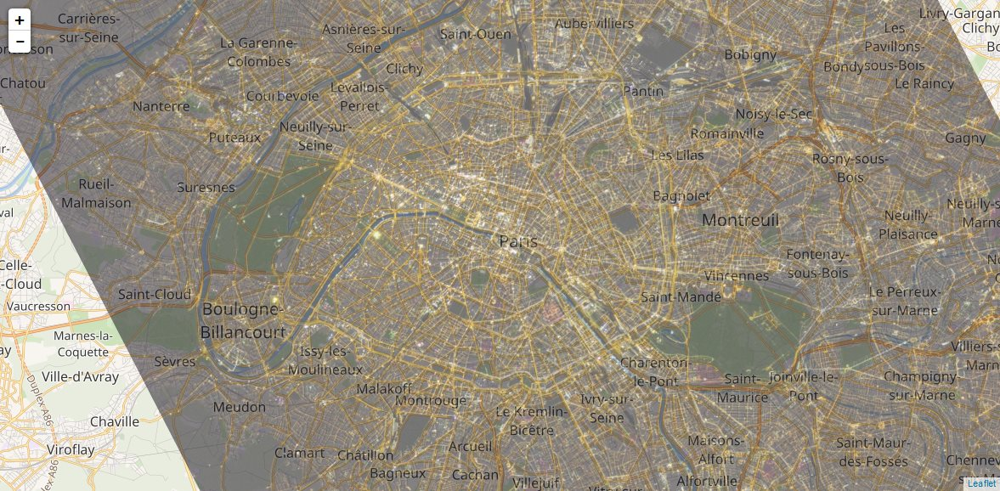
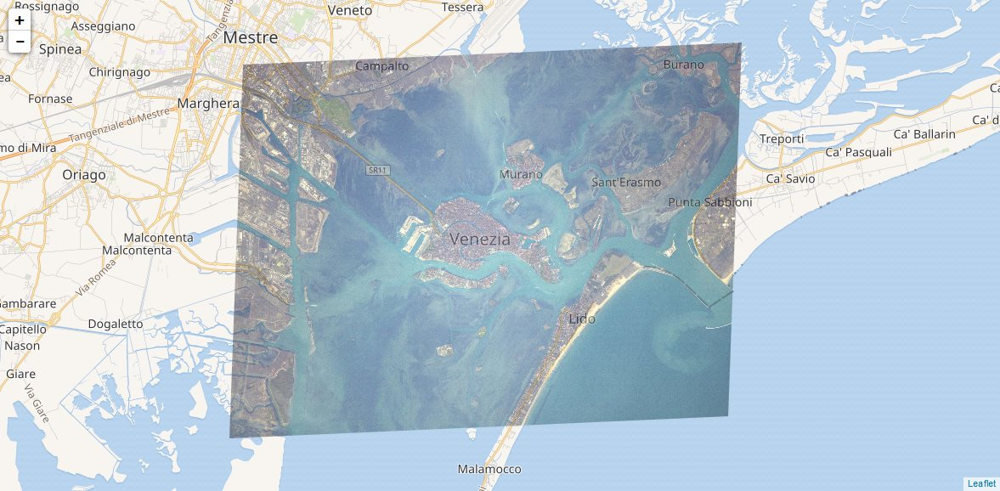

Earth view with Thomas Pesquet photographies from ISS
=====================================================



Thomas Pesquet, the french astronaut on ISS,
is taking many photographies of Earth, especially cities.

This application references some of these photographies,
and superimposes them on a Earth view.

Just navigate on the Earth like Google Maps,
and switch between Earth view/Earth photographies from ISS.

Maybe you'll see your city or your house from the ISS!


### Demonstration

[Check the Demonstration](https://alcalyn.github.io/see-yourself-from-space).


## Install locally

``` bash
git clone https://github.com/alcalyn/see-yourself-from-space.git
```

Then, using your browser, go to the `index.html` file
(no need for webserver, only html/js).


## Photographies

For now you can navigate to these locations:

 - [Paris, France](https://alcalyn.github.io/see-yourself-from-space/#11/48.8561/2.3494)
 - [La Rochelle, France](https://alcalyn.github.io/see-yourself-from-space/#13/46.1581/-1.1726)
 - [Venezia, Italia](https://alcalyn.github.io/see-yourself-from-space/#12/45.4323/12.3459)


## Technical stack

This application uses:

 - [Leaflet](http://leafletjs.com/) for map view
 - Thomas Pesquet photographies from his [Twitter account](https://twitter.com/Thom_astro)


## Adding a photography

Want to add your city ?

Fork the project, download the photography, and place it on the map.

### Download the photography

From [Thomas Pesquet twitter account](https://twitter.com/Thom_astro),
click the photography, open it in your browser.
make sure to set `:orig` at the end of the url (i.e `https://pbs.twimg.com/media/C5S2BmnWIAAblpa.jpg:orig`)
to have a good quality photography.

The best would be to have a `3276 x 2183` pixels.

Add the photography to the `photos/` folder

### Place the photography

Go to `js/content.js`, and duplicate a `photo` item:

``` js
        {
            light: "day",
            url: "photos/venezia.jpg",
            alt: "Venezia",
            size: {width: 3276, height: 2183},
            anchors: [
                {
                    // Lido Island
                    pixel: {x: 1220, y: 435},
                    coords: {lat: 45.405704263039794, lon: 12.360885143280031}
                },
                {
                    // Burano
                    pixel: {x: 336, y: 2075},
                    coords: {lat: 45.487019515608054, lon: 12.41952896118164}
                },
                {
                    // Street intersect
                    pixel: {x: 2769, y: 1840},
                    coords: {lat: 45.470981023898084, lon: 12.269443273544313}
                }
            ]
        }
```

First, it requires a few basics informations like
the photo url, size in pixels, `day` or `night` photography.

And last but not least, it needs three *anchor* points,
for which you need to know the coordinates **both** in pixels and GPS coords.

They should (recommended) form a triangle, the greatest possible,
and the nearest to equilateral (not a flat triangle).

And choose a precise enough point like streets intersections,
end of road, peak of land, monument...

Then just refresh the `index.html` page and check the result.



## License

This application is under [MIT License](LICENSE).
